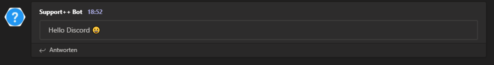

# Microsoft Teams Notification API


Wir haben mit dem Microsoft Teams Module, einen neuen Notification Dienst zu unserem System hinzugefügt. Ab sofort ist es nun möglich Support++ Nachrichten / Tickets direkt an Microsoft Teams zu schicken.

## Warum Microsoft Teams?

Microsoft Teams ist einer der meist genutzten Team Kommunikation Lösungen, die gerade in Unternehmen immer öfter zum Einsatz kommen.


In diesem Jahr hat Microsoft Teams fast doppelt so viel User wie der ehemalige Konkurrent Slack. Aber auch für Slack wird es in Zukunft ein Module geben.

Die Integration in Messenger, kann die Bearbeitung von Tickets und Support Anfragen entlasten und die Arbeit optimieren.

## Wie funktioniert der Spaß?

Durch die Vereinheitlichung unserer Notification API, gibt es auch hier eine Web API, die Sie unter `https://api.support-pp.de` erreichen. Wir haben uns bewusst gegen Webhooks entschieden, um das Script zu entlasten und die Anfragen zu vereinheitlichen. Den Quellcode finden sie wie gewohnt auf GitHub.

## So stelle ich Anfragen

Endpoint: `https://api.support-pp.de`

Nachricht erstellen
`POST /api/teams/notification`
Body:

```json
{
  "message": "Hello Teams 😀",
  "embed": true,
  "url": "https://outlook.office.com/webhook/7c6423...."
}
```

Mit dem Boolean embed kann die Ansicht in Teams angepasst werden.


## Rate Limit

Die API besitzt ein Limit von 5 Nachrichten pro Minute. Dieses ist einmal einen Schutzmaßnahme von unserer Infrastruktur, aber auch eine Maßnahme um nicht ins Microsoft Teams Limit zu kommen.
