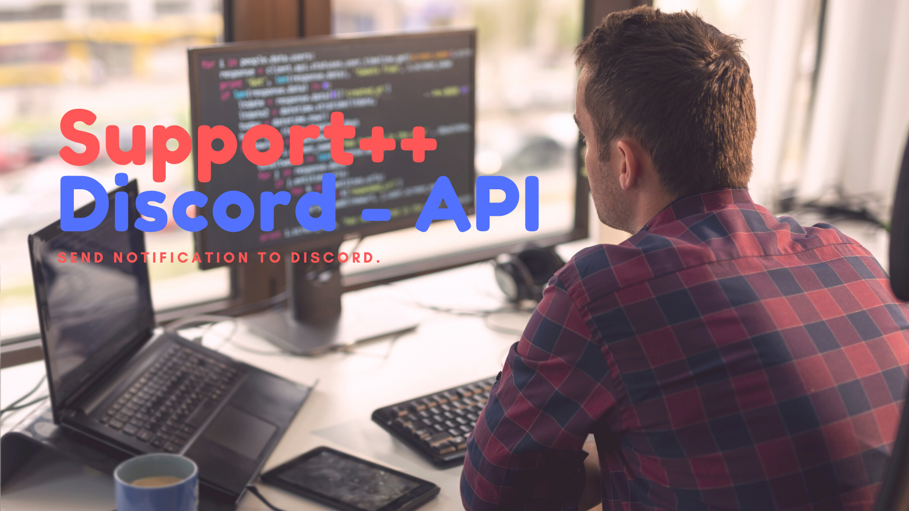

# Discord Notification API



Wir haben mit dem neuen Discord Module eine neue API entwickelt. Dieses basiert nun auf express.js - NodeJS Framework. In unserem ersten Discord Module haben wir auf C# mit ASP.net Endpunkt gesetzt. Doch wie wir merkten, wurden die Anfragen immer mehr, ASP.NET immer langsamer und Wartungsanfälliger. Wir haben nun beschlossen, den Discord Bot noch mal neu zu schreiben. Jetzt Open Source und auf einer modernen Platform. Discord.js wird regelmäßig geupdatet, so dass wir auch dieses Problem weniger haben.

## Wie funktioniert die Discord Bridge?

Wir haben bewusst auf einen DB verzichtet, denn umso weniger Daten umso besser. Sinusbot sendet via HTTP Anfragen an unseren express API Server, dieser leitet dann die Nachrichten an die Discord Websocket Schnittstelle weiter. Um sicherzugehen, dass jeder auch nur Nachrichten in Channel sendet, wofür er Berechtigungen hat. Sind die Channel durch sogenannt „Tokens“ geschützt. Bei der Eingabe des Command `!id` wird ein JWT Token auf Basis eines privaten RSA Key generiert. Dabei setzten wir als Eigenschaft die Channel ID.

So müssen wir bei einer HTTP Anfrage nur noch validieren, ob der JWT Token mit unserer Signature übereinstimmt. Ist das der Fall können wir entspannt die Nachricht, an den Channel aus den JWT Eigenschaften senden.

Um also eine Nachricht an einen unautorisierten Channel zu senden, wird der Private RSA Key benötigt.

## Aber warum nicht einfach eine Webhook?

Wir wissen was das ist. Aber es hat einige Gründe, warum diese Webhook für unser Szenario nicht geeignet ist. Webhooks sind in der Regel einseitig. `Sinusbot` -> `Discord`.

Da wir bei manchen Funktionen auf einen Antwort bzw. Reaktion warten z.B. `/reply` Command. Ist eine Webhook ungeeignet. Klar könnten wir mithilfe von WebSocket das ganze direkt im Support++ Script implementieren.

1. Viel zu viel Aufwand in der Entwicklung.

2. Die Performance wird dadurch vom Sinusbot bzw. der Script Engine noch schlechter. Große Server kämpfen ja jetzt schon mit Script Timeouts bei zu vielen Aktionen gleichzeitig.

3. Ist dieser Schritt komplizierter für den Endnutzer.
   Einen oAuth Link klicken. Bot anschreiben mit `!id` Antwort in Script einfügen. Fertig. Wohingegen bei einer direkten Implementierung erstmal eine Webhook erstellt werden muss. bzw. ein Bot Anwendung.

## So stelle ich Anfragen

Endpoint: [https://api.support-pp.de](https://api.support-pp.de)
Authorization `Header: Bearer <token from !id>`

1. Nachricht erstellen
   `POST /api/discord/notification`

Body:

```json
{
  "message": "Hello Discord :smiley:",
  "embed": true
}
```

Mit dem Boolean `embed` kann die Ansicht in Discord angepasst werden.


## Rate Limit

Die API besitzt ein Limit von 5 Nachrichten pro Minute. Dieses ist einmal einen Schutzmaßnahme von unserer Infrastruktur, aber auch eine Maßnahme um nicht ins Discord Limit zu kommen.
