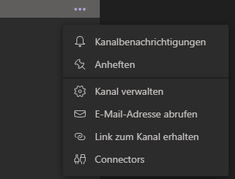
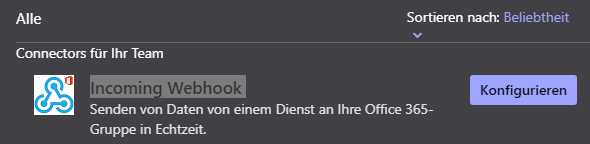
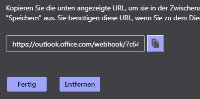

# Microsoft Teams Module

## Einleitung

Sie möchten auch über Kunden informiert werden, die auf Ihrem TeamSpeak³ Server, in Ihrerer Abwesenheit einen der Support Channel betreten hat? Oder doch einfach nur als Übersicht? Kein Problem, das Microsoft Teams module ist eine Art Notification Bridge und sendet Benachrichtigungen in einen vorher definierten Teams Channel.

## Installation

<Aside type='warning' header='⚠️ Dieses Module ist ab Version 2.7.0 verfügbar.'>
</Aside>

1.  Öffnen Sie Microsoft Teams. Rechtsklick auf den Channel, in dem Sie Benachrichtigungen empfangen möchten.
    

2.  Klicken Sie auf `Connectors`

3.  Suchen Sie dort unter der Kategorie `Alle` den `Incoming Webhook` Connector aus.
    

4.  Starten Sie mit der Konfiguration, legen Sie einen Namen fest (freie Auswahl) und laden Sie ggf. ein Bild hoch.
5.  Klicken Sie auf Erstellen und kopieren die angezeigte URL
    

Die URL geben Sie nun in die Support++ Konfiguration ein. Fertig.

## Probleme

**Ich empfangen keine Nachrichten**  
Überprüfen Sie, ob die URL richtig ist. Erstellen Sie ggf. eine neue Webhook URL.

**Ich erhalte die Fehlernachricht `5990 Blocked`**
Es scheint so, als ob unser System Sie aufgrund von Float oder Spamming
blockiert hat. Wir geben Ihnen jederzeit eine Möglichkeit, diese
Blockade aufzuheben. Bitte schreiben Sie uns einfach auf Discord.

**Gibt es die Funktion `/reply` noch?**
Momentan nicht, wir sind aber mit Hochdruck daran, diese Funktion
überarbeitet und mit mehr Funktionen wieder freizuschalten.
