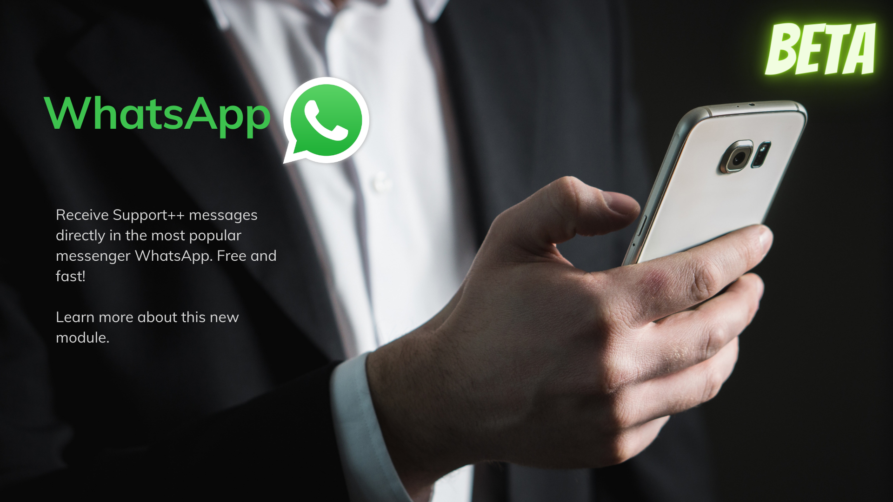
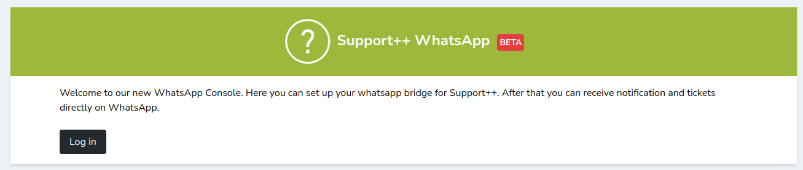
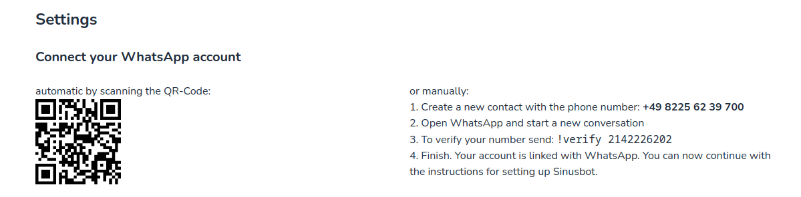
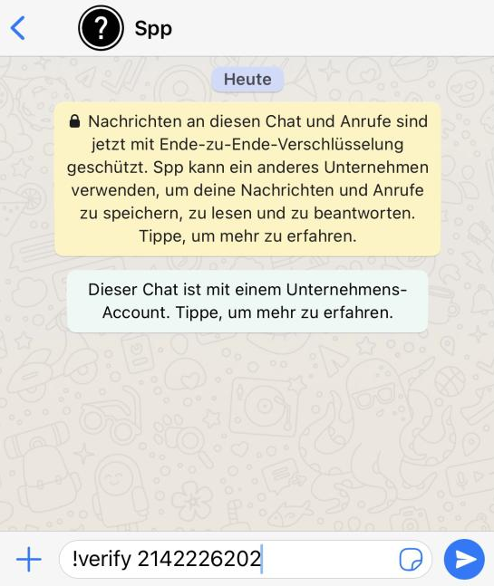
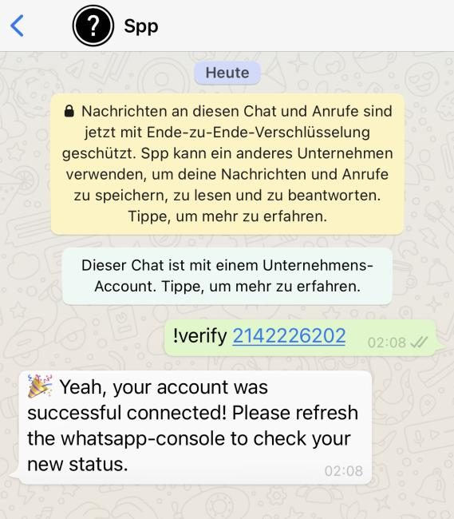
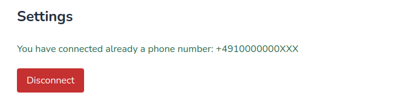

# WhatsApp Module




## Einleitung

Sie möchten auch über Kunden informiert werden, die auf Ihrem TeamSpeak³
Server, in Ihrerer Abwesenheit einen der Support Channel betreten hat?
Oder doch einfach nur als Übersicht? Kein Problem, das WhatsApp module
ist eine Art Notification Bridge und sendet Benachrichtigungen direkt 
an einen vorher verifizierten Nummer.

## Installation

<Aside type='warning' header='⚠️ Um dieses Module nutzen zu können, benötigen Sie einen Account für die closed beta. Sie können sich hier anmelden: <a href="https://beta-whatsapp.support-pp.de/">https://beta-whatsapp.support-pp.de/</a>'>
</Aside>
<Aside type='warning' header='⚠️ Dieses Module ist ab Version 2.7.0 verfügbar.'>
</Aside>



1.  Öffnen Sie unsere [WhatsApp-Console](https://whatsapp-console.support-pp.de/)
3.  Melden Sie sich mit den Zugangsdaten an. 
**Hinweis: Die Zugangsdaten erhalten Sie nach freigabe im BETA Programm. Die Zugangsdaten können nur durch Support++ Teammitglieder erstellt werden.**



7.  Scannen Sie den QR-Code mit einem entsprechenden QRCode-Scanner *(Tipp: moderne Smartphones haben diesen bereits in der normalen Kamera App integriert.)*



9.  Daraufhin öffnet sich WhatsApp mit einer Nachricht: ```!verify xxxxxxxxx```.



11.  Senden Sie diese Nachricht an unseren Bot. Fertig! Sie haben Ihre Nummer nun verifiziert.
12.  Öffnen Sie erneut die [WhatsApp-Console](https://whatsapp-console.support-pp.de/) und aktualisieren Sie die Webseite.
    Sie sollten nun die Nachricht sehen, dass eine Nummer erfolgreich verknüpft wurde.
    


6. Klicken Sie auf den Button ("Create new API Key") um einen neuen Token zu generieren. Fügen Sie diesen in der Sinusbot Konfiguration ein. 
Mit diesem Schritt ist die Installation abgeschlossen.

Sie sollten nach dem speichern eine Nachricht erhalten. Der Vorgang ist
nun abgeschlossen und Sie können nun Nachrichten in Discord empfangen.

## Probleme

**Ich empfangen keine Nachrichten**  
Überprüfen Sie, ob Ihre Nummer verifiziert ist, Ihre API Key gültig ist und Sie den Bot nicht blockiert haben.
Kontaktieren Sie uns bei weiteren Problemen.

**Ich erhalte die Fehlernachricht `5990 Blocked`**
Es scheint so, als ob unser System Sie aufgrund von Float oder Spamming
blockiert hat. Wir geben Ihnen jederzeit eine Möglichkeit, diese
Blockade aufzuheben. Bitte schreiben Sie uns einfach auf Discord.

**Was bedeutet Limit erreicht?**
Wir haben eine Begrenzung für Nachrichten eingebaut. Sie können nur x Nachrichten pro Tag über WhatsApp empfangen.
Dies ist auf anfallende Kosten auf unsererseite zurückzuführen. 
